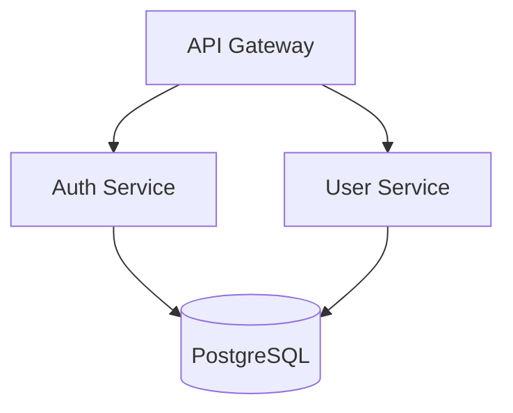

# Nanobot Architect

Architecture design and analysis tools for making informed technical decisions with nanobot.

## Use when

- User asks to "design system architecture", "evaluate microservices vs monolith", "create architecture diagrams"
- Analyzing dependencies, choosing a database, planning for scalability
- Making technical decisions or reviewing system design
- Need architecture decision records (ADRs), tech stack evaluation, or generating architecture diagrams
- Working with nanobot superpowers project structure and need architectural guidance

## Core principle

Good architecture balances current needs with future flexibility. nanobot helps you make informed decisions by analyzing code structure, dependencies, and generating visual diagrams—but the architectural judgment and trade-off decisions remain with the team.

## The Process

### 1. Understand the Current State

Before designing anything new, understand what exists:

```
# Generate architecture diagram from project
python scripts/architecture_diagram_generator.py ./my-project --format mermaid

# Analyze dependencies for issues
python scripts/dependency_analyzer.py ./my-project --output json

# Get architecture assessment
python scripts/project_architect.py ./my-project --verbose
```

**nanobot analyzes:**
- Existing patterns (MVC, layered, hexagonal, microservices indicators)
- Code organization issues (god classes, mixed concerns)
- Layer violations and missing architectural components
- Dependency tree (direct and transitive), circular dependencies, coupling scores

### 2. Make Architecture Decisions

Use structured workflows for common decisions:

#### Database Selection Workflow

| Characteristic | Points to SQL | Points to NoSQL |
|---------------|---------------|------------------|
| Structured with relationships | ✓ | |
| ACID transactions required | ✓ | |
| Flexible/evolving schema | | ✓ |
| Document-oriented data | | ✓ |
| Time-series data | | ✓ (specialized) |

**Quick reference for nanobot projects:**
```
PostgreSQL → Default choice for most nanobot applications
MongoDB    → Document store, flexible schema
Redis      → Caching, sessions, real-time features
DynamoDB   → Serverless, auto-scaling, AWS-native
TimescaleDB → Time-series data with SQL interface
```

#### Architecture Pattern Selection

| Team Size | Recommended Starting Point |
|-----------|---------------------------|
| 1-3 developers | Modular monolith |
| 4-10 developers | Modular monolith or service-oriented |
| 10+ developers | Consider microservices |

**Pattern matching for nanobot:**
| Requirement | Recommended Pattern |
|-------------|-------------------|
| Rapid MVP development | Modular Monolith |
| Independent team deployment | Microservices |
| Complex domain logic | Domain-Driven Design |
| High read/write ratio difference | CQRS |
| Audit trail required | Event Sourcing |
| Third-party integrations | Hexagonal/Ports & Adapters |

#### Monolith vs Microservices Decision

**Choose Monolith when:**
- [ ] Team is small (<10 developers)
- [ ] Domain boundaries are unclear
- [ ] Rapid iteration is priority
- [ ] Operational complexity must be minimized
- [ ] Shared database is acceptable

**Choose Microservices when:**
- [ ] Teams can own services end-to-end
- [ ] Independent deployment is critical
- [ ] Different scaling requirements per component
- [ ] Technology diversity is needed
- [ ] Domain boundaries are well understood

**Hybrid approach for nanobot:**
Start with a modular monolith. Extract services only when:
1. A module has significantly different scaling needs
2. A team needs independent deployment
3. Technology constraints require separation

### 3. Generate Diagrams

nanobot can generate architecture diagrams in multiple formats:

```bash
# Mermaid format (default, works in markdown)
python scripts/architecture_diagram_generator.py ./project --format mermaid --type component

# PlantUML format
python scripts/architecture_diagram_generator.py ./project --format plantuml --type layer

# ASCII format (terminal-friendly)
python scripts/architecture_diagram_generator.py ./project --format ascii

# Save to file
python scripts/architecture_diagram_generator.py ./project -o architecture.md
```

**Supported diagram types:**
- `component` - Shows modules and their relationships
- `layer` - Shows architectural layers (presentation, business, data)
- `deployment` - Shows deployment topology

**Example Mermaid output:**


### 4. Document Decisions

Create Architecture Decision Records (ADRs) for significant choices:

```
## ADR 001: Choose Database for User Service

**Context:** Need to store user profiles with flexible attributes
**Decision:** Use MongoDB for user service
**Rationale:** User profiles have varying attributes per user type
**Alternatives considered:**
- PostgreSQL: Rejected due to schema rigidity
- Redis: Rejected as primary store (persistence concerns)
**Trade-offs accepted:** Eventually consistent reads, less mature tooling
```

### 5. Validate with nanobot

After implementing architectural changes:
1. Run dependency analysis to detect new circular dependencies
2. Generate updated architecture diagrams
3. Review coupling scores (target: <70)
4. Check for layer violations

```bash
# Full validation
python scripts/dependency_analyzer.py ./project --verbose
python scripts/project_architect.py ./project --check layers
```

## Tools Included

### Architecture Diagram Generator
Generates architecture diagrams from project structure in Mermaid, PlantUML, or ASCII.

### Dependency Analyzer
Analyzes project dependencies for coupling, circular dependencies, and outdated packages.

**Supported package managers:**
- npm/yarn (`package.json`)
- Python (`requirements.txt`, `pyproject.toml`)
- Go (`go.mod`)
- Rust (`Cargo.toml`)

### Project Architect
Analyzes project structure and detects architectural patterns, code smells, and improvement opportunities.

## Red Flags

- **Circular dependencies** between modules → Extract shared interface
- **Coupling score >80** → Refactor to reduce inter-module dependencies
- **God classes (>20 methods)** → Split into focused services/classes
- **Mixed concerns in controllers** → Move business logic to services
- **No architecture documentation** → Create ADRs for each significant decision
- **Layer violations** (e.g., data layer accessing presentation) → Enforce layered architecture
- **Over-engineering** → Start simple (modular monolith), extract only when needed

## Tech Stack Coverage

**Languages:** TypeScript, JavaScript, Python, Go, Swift, Kotlin, Rust
**Frontend:** React, Next.js, Vue, Angular, React Native, Flutter
**Backend:** Node.js, Express, FastAPI, Go, GraphQL, REST
**Databases:** PostgreSQL, MySQL, MongoDB, Redis, DynamoDB, Cassandra
**Infrastructure:** Docker, Kubernetes, Terraform, AWS, GCP, Azure
**CI/CD:** GitHub Actions, GitLab CI, CircleCI, Jenkins

## Common nanobot Commands

```bash
# Architecture visualization
python scripts/architecture_diagram_generator.py . --format mermaid
python scripts/architecture_diagram_generator.py . --format plantuml
python scripts/architecture_diagram_generator.py . --format ascii

# Dependency analysis
python scripts/dependency_analyzer.py . --verbose
python scripts/dependency_analyzer.py . --check circular
python scripts/dependency_analyzer.py . --output json

# Architecture assessment
python scripts/project_architect.py . --verbose
python scripts/project_architect.py . --check layers
python scripts/project_architect.py . --output json
```

## References

Load these files from the SKILL's `references/` directory for detailed information:

| File | Contains | When to load |
|------|----------|--------------|
| `references/architecture_patterns.md` | 9 architecture patterns with trade-offs, code examples | "which pattern?", "microservices vs monolith" |
| `references/system_design_workflows.md` | Step-by-step workflows for system design tasks | "how to design?", "capacity planning" |
| `references/tech_decision_guide.md` | Decision matrices for technology choices | "which database?", "which framework?" |
